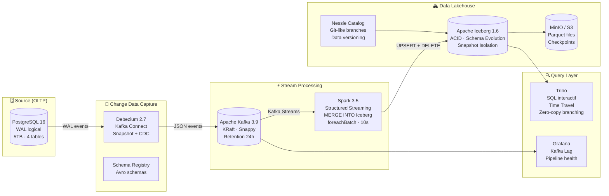

# 🏔️ CDC Lakehouse — PostgreSQL → Apache Iceberg en Temps Réel

## 💡 Concept & Objectifs

### 🌟 L'Idée Centrale
Ingestion en temps réel sans interruption des modifications (Inserts/Updates/Deletes) d'une base relationnelle de production PostgreSQL vers un Lakehouse analytique moderne. Gère l'évolution automatique des schémas et le versioning de type Git sur la donnée (Nessie catalog).

### 🎯 Le But Recherché (Valeur Métier & Technique)
* **Objectif Principal** : Résoudre la problématique business et technique liée à la thématique du projet.
* **Stack Technique exploitée** : Debezium, Kafka Connect, Apache Kafka, Apache Spark, Apache Iceberg, MinIO/S3, Nessie, Trino
* **Livrables Clés** : Environnement Docker complet (Postgres, Debezium, Kafka Connect, Spark, MinIO, Trino, Nessie), application de streaming Spark pour les fusions ACID, et scripts de requêtes analytiques avec time-travel.


<div align="center">

[](https://www.python.org/)
[](https://debezium.io/)
[](https://kafka.apache.org/)
[](https://iceberg.apache.org/)
[](https://spark.apache.org/)

**Synchronisation temps réel d'une base PostgreSQL 5TB vers un Data Lakehouse — sans downtime**  
**10M+ changements/heure · Lag < 60 secondes · Time Travel · ACID Merges · Zero-Copy Branching**

[Architecture](#architecture) · [Démarrage](#démarrage-en-5-commandes) · [Time Travel](#time-travel--branching) · [Monitoring](#monitoring)

</div>

---

## 🎯 Contexte Métier

Une plateforme SaaS génère des **10M+ changements par heure** sur sa base PostgreSQL (clients, commandes, stocks). L'équipe analytics a besoin de ces données en quasi temps réel pour ses dashboards, sans impacter la performance de la base de production.

Ce pipeline capture **chaque INSERT/UPDATE/DELETE** via le WAL PostgreSQL, l'achemine dans Kafka, et l'écrit dans Apache Iceberg avec garantie ACID — le tout avec un lag < 60 secondes.

---

## 🏗️ Architecture



### Tables CDC surveillées

| Table | Opérations | Volume estimé | Clé primaire |
|-------|-----------|---------------|-------------|
| `sales.customers` | INSERT, UPDATE | ~1M clients | `customer_id` |
| `sales.orders` | INSERT, UPDATE, DELETE | ~500K commandes/mois | `order_id` |
| `sales.order_items` | INSERT, DELETE | ~2M lignes/mois | `item_id` |
| `sales.inventory` | UPDATE | ~10K SKUs | `sku` |

---

## 🚀 Démarrage en 6 Commandes

```bash
# 1. Lancer toute l'infrastructure
docker compose up -d

# 2. Attendre que Kafka Connect soit prêt (~30s), puis enregistrer le connector Debezium
bash src/debezium/register-postgres-connector.sh

# 3. Vérifier que le connector tourne
curl http://localhost:8083/connectors/postgres-source/status

# 4. Installer les dépendances Python locales et lancer le générateur de transactions
pip install -r requirements.txt && python src/scripts/generate_changes.py

# 5. Soumettre le job Spark Streaming (Kafka → Iceberg)
bash src/spark-streaming/submit_job.sh

# 6. Lancer le dashboard Streamlit de visualisation
streamlit run src/scripts/dashboard.py
```

### Services disponibles

| Service | URL | Description |
|---------|-----|-------------|
| **Streamlit Dashboard** | http://localhost:8501 | Visualisation interactive & Time Travel |
| **Kafka Connect** | http://localhost:8083 | Status des connectors |
| **Spark UI** | http://localhost:4040 | Jobs streaming en cours |
| **Nessie UI** | http://localhost:19120 | Branches et commits |
| **MinIO Console** | http://localhost:9003 | Fichiers Parquet (admin/password123) |
| **Trino** | `trino --server localhost:8081` | SQL sur Iceberg |
| **Grafana** | http://localhost:3001 | Dashboards CDC (admin/admin) |

---

## 🔭 Time Travel & Branching

### Requêtes Time Travel avec Trino

```sql
-- Voir les données AVANT une mise à jour (il y a 2 heures)
SELECT * FROM iceberg.iceberg_warehouse.customers
FOR TIMESTAMP AS OF TIMESTAMP '2026-07-13 07:00:00';

-- Voir les données AVANT une mise à jour (snapshot spécifique)
SELECT * FROM iceberg.iceberg_warehouse.orders
FOR VERSION AS OF 12345678;

-- Comparer l'état actuel vs. hier
SELECT new.total_amount - old.total_amount AS delta
FROM iceberg.iceberg_warehouse.orders AS new
JOIN (
  SELECT order_id, total_amount
  FROM iceberg.iceberg_warehouse.orders
  FOR TIMESTAMP AS OF TIMESTAMP '2026-07-12 09:00:00'
) AS old USING (order_id)
WHERE new.status = 'delivered';
```

### Branching Nessie (Zero-Copy Fork pour Data Scientists)

```sql
-- Créer une branche expérimentale (0 copie des données)
CALL iceberg.system.create_branch('iceberg_warehouse', 'experiment_q3', 'main');

-- Basculer sur la branche
SET SESSION iceberg.nessie_catalog_ref = 'experiment_q3';

-- Modifier sans risque (la branche main est intacte)
UPDATE iceberg.iceberg_warehouse.customers
SET loyalty_tier = 'platinum' WHERE total_orders > 50;

-- Revenir à main (données inchangées)
SET SESSION iceberg.nessie_catalog_ref = 'main';

-- Merger si le résultat est bon
CALL iceberg.system.merge_branch('iceberg_warehouse', 'experiment_q3', 'main');
```

---

## 📊 Monitoring

### Métriques clés suivies

| Métrique | Dashboard | SLA |
|----------|-----------|-----|
| **Kafka Consumer Lag** | Grafana | < 10 000 messages |
| **CDC Events/min par table** | Grafana | > 0 (pipeline vivant) |
| **Spark Batch Duration** | Spark UI | < 30s/batch |
| **Iceberg Snapshot Size** | Nessie | Trending stable |
| **Connector Status** | Kafka Connect API | `RUNNING` |

```bash
# Vérifier le lag Kafka
docker compose exec kafka \
  /opt/kafka/bin/kafka-consumer-groups.sh \
  --bootstrap-server kafka:9092 \
  --describe --group spark-cdc

# Status du connector Debezium
curl http://localhost:8083/connectors/postgres-source/status | python -m json.tool
```

---

## 🧪 Valider le Pipeline End-to-End

```bash
# Insérer un client de test dans PostgreSQL
docker compose exec postgres psql -U postgres -d source_db -c \
  "INSERT INTO sales.customers (name, email, phone, loyalty_tier) \
   VALUES ('Test User', 'test@example.com', '+33-6-00-00-00-00', 'gold');"

# Attendre ~10-15s (lag Spark batch), puis vérifier dans Iceberg via Trino
trino --server localhost:8081 --execute \
  "SELECT * FROM iceberg.iceberg_warehouse.customers WHERE name = 'Test User';"

# Mettre à jour et vérifier la réplication
docker compose exec postgres psql -U postgres -d source_db -c \
  "UPDATE sales.customers SET loyalty_tier = 'platinum' WHERE name = 'Test User';"
```

---

## 🔬 Structure du Projet

```
03-CDC-Iceberg-Lakehouse/
├── docker-compose.yml              # PostgreSQL, Debezium, Kafka, Spark, Iceberg, Trino, Nessie
├── .env / .env.example
│
├── src/
│   ├── debezium/
│   │   └── register-postgres-connector.sh  # Déploiement du connector via REST API
│   ├── spark-streaming/
│   │   ├── cdc_to_iceberg.py              # Spark Structured Streaming + MERGE INTO Iceberg
│   │   └── submit_job.sh                  # Soumission du job Spark
│   ├── scripts/
│   │   ├── init-source.sql                # Initialisation du schéma PostgreSQL
│   │   └── generate_changes.py            # Générateur CDC (INSERT/UPDATE/DELETE en continu)
│   ├── trino/
│   │   ├── catalog/
│   │   │   ├── iceberg.properties         # Config catalog Iceberg + Nessie
│   │   │   └── postgresql.properties      # Config catalog PostgreSQL (federation)
│   │   ├── queries_demo.sql               # Requêtes de démonstration
│   │   └── queries_nessie_branching.sql   # Exemples time travel + branching
│   └── monitoring/
│       └── dashboards/cdc_pipeline.json   # Dashboard Grafana (6 panels)
```

---

## 💡 Ce que ce projet démontre

- **Change Data Capture** avec Debezium (PostgreSQL WAL → Kafka)
- **Exactly-once semantics** de Kafka vers Apache Iceberg
- **MERGE INTO Iceberg** : UPSERT + DELETE atomiques dans un lakehouse
- **Schema evolution** : ajout de colonnes sans downtime
- **Time Travel** SQL avec Trino (`FOR TIMESTAMP AS OF`)
- **Data versioning** avec Nessie (branches Git sur les données)
- **Zero-copy branching** pour les data scientists
- **Gestion des tombstones** (DELETE events Debezium) dans Iceberg
- **Monitoring** du lag Kafka Consumer et de la santé du pipeline

---

> 🏗️ **Projet suivant :** [Document Intelligence](../../03-AI-Engineering/03-Document-Intelligence-OCR-LayoutLM) — Extraction automatique d'information sur 50K documents/jour
