# Architecture — Pipeline CDC Iceberg Lakehouse

```mermaid
graph LR
    subgraph "Source"
        PG[(PostgreSQL<br/>WAL logical)]
        CG[Change Generator<br/>Python]
    end

    subgraph "CDC Layer"
        DB[Debezium Connector<br/>Kafka Connect]
        K[Kafka<br/>3 topics CDC]
    end

    subgraph "Processing"
        SP[Spark Structured<br/>Streaming]
        ICE[Iceberg Tables<br/>MinIO]
    end

    subgraph "Catalog & Query"
        NE[Nessie<br/>Git-like branching]
        TR[Trino<br/>SQL + Time travel]
    end

    subgraph "Monitoring"
        GF[Grafana<br/>Dashboard]
    end

    CG -->|INSERT/UPDATE/DELETE| PG
    PG -->|WAL streaming| DB
    DB -->|Événements JSON| K
    K -->|Streaming| SP
    SP -->|MERGE INTO| ICE
    ICE --> NE
    NE --> TR
    TR --> GF

    style PG fill:#336791,color:#fff
    style DB fill:#FF6B6B,color:#fff
    style K fill:#231F20,color:#fff
    style SP fill:#E25A1C,color:#fff
    style ICE fill:#4CAF50,color:#fff
    style NE fill:#9C27B0,color:#fff
    style TR fill:#00BCD4,color:#fff
    style GF fill:#FF9800,color:#fff
```

## Flux

1. **Change Generator** insère/modifie/supprime des données dans PostgreSQL
2. **WAL PostgreSQL** propage le changement à Debezium
3. **Debezium** transforme en événement JSON et publie dans Kafka
4. **Kafka** stocke les événements avec compression Snappy
5. **Spark Streaming** lit Kafka et applique un `MERGE INTO` sur Iceberg
6. **Iceberg** stocke les données en format ouvert sur MinIO
7. **Nessie** catalogue les tables avec support de branches
8. **Trino** permet le requêtage SQL avec time travel

## Ports

| Service | Port |
|---------|------|
| PostgreSQL | 5432 |
| Kafka | 9092 |
| Kafka Connect | 8083 |
| MinIO API | 9002 |
| MinIO Console | 9003 |
| Nessie | 19120 |
| Spark UI | 4040 |
| Trino | 8081 |
| Grafana | 3001 |
